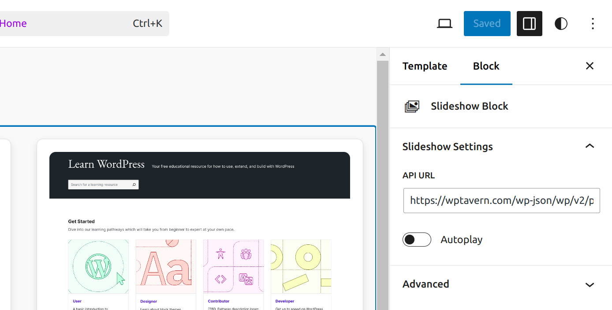

=== Gutenberg Slideshow ===
Contributors:      Soham Banerjee
Tags:              block
Tested up to:      6.1
Stable tag:        0.1.0
License:           GPL-2.0-or-later
License URI:       https://www.gnu.org/licenses/gpl-2.0.html

Example block scaffolded with Create Block tool.

Checkout Live site [here](https://slideshow-block-for-rtcamp.infinityfreeapp.com/)

== Description ==

A slideshow block that fetches and displays the latest posts.

== Installation ==

to setup this plugin in any wordpress site follow this following steps : 

1. add this folder to wp-content/plugins manually or,
2. go to wp admin panel -> then to plugins -> then add new plugin and choose this folder
3. in this folder ctrl + alt + T to open terminal inside this folder and type in code . to open a code editor (VScode lets say)
4. open terminal in vs code
5. npm install
6. npm run start
7. from wp-admin panel in plugins sections activate the corresponding plugin if it is deactivated.
8. open gutenberg editor
9. press three dots and add after
10. + to add this plugin from widgets section
11. you can see preview of this plugin with wptavern.com's posts api endpoint as the default site.
12. select this block and open block settings from top righthand corner of the screen and type in correspoing api url and refresh page to update api url to fetch posts from a different wordpress website conforming to the conditions and accessible openly.

13. toggle autoplay on/off button to switch between autoplay on and manual swiping.

Thank you. Enjoy using the plugin.  
Soham Banerjee  
for any problems  
Mail to: sohambanerg@gmail.com   
Linkedin: [link](https://www.linkedin.com/in/soham13anerjee/)
